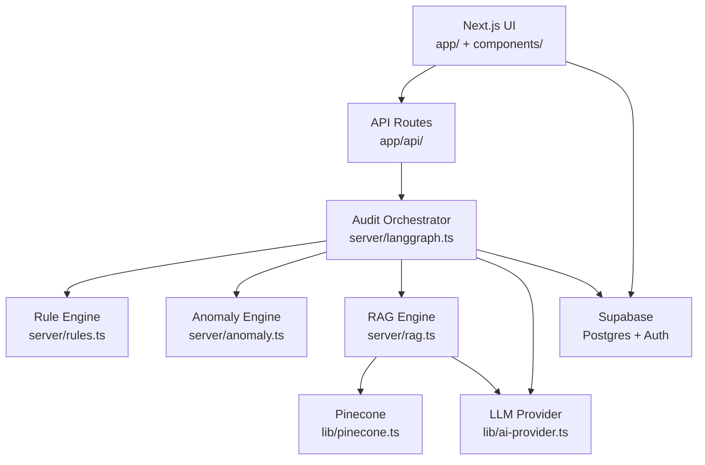

# AuditLens AI — Project Map

> Agent 导航用架构地图。操作指令见 [AGENT.md](./AGENT.md)，完整细节见 [docs/architecture.md](./docs/architecture.md)。

## 一句话

Next.js 全栈应用：用户上传财务表格 → LangGraph 审计流水线 → 规则/异常/RAG/LLM → Supabase 存结果 → Dashboard 与报告展示。

## 系统分层



## 入口点

| 入口 | 文件 | 说明 |
|------|------|------|
| 应用根 | `app/layout.tsx` | 全局布局、Provider |
| 登录 | `app/login/page.tsx` | Supabase email/password |
| 上传 | `app/upload/page.tsx` | Excel/CSV → 触发审计 |
| 仪表盘 | `app/dashboard/page.tsx` | KPI、图表、Issue 表 |
| 报告 | `app/report/[id]/page.tsx` | 结构化报告 |
| 审计 API | `app/api/audit/route.ts` | 创建任务、启动 Graph |
| 路由保护 | `middleware.ts` | JWT / session 校验 |
| Graph 编排 | `server/langgraph.ts` | 节点注册与边 |
| 引擎协调 | `server/audit-engine.ts` | 对外单一调用入口 |

## LangGraph 流水线

```text
ParseExcel → RuleCheck → AnomalyDetection → RiskScoring → RAGExplain → ReportGeneration
```

| 节点 | 模块 | 输入 → 输出 |
|------|------|-------------|
| ParseExcel | `server/langgraph.ts` | 文件 → `Record[]` |
| RuleCheck | `server/rules.ts` | records → issues（重复、审批缺失等） |
| AnomalyDetection | `server/anomaly.ts` | records → anomalies（金额、供应商集中） |
| RiskScoring | `server/audit-engine.ts` | issues + anomalies → score |
| RAGExplain | `server/rag.ts` | risk context → LLM 解释 |
| ReportGeneration | `server/langgraph.ts` | 全 state → markdown report |

## 领域类型（`types/audit.ts`）

```ts
type Record = {
  date: string;
  type: "income" | "expense";
  amount: number;
  vendor: string;
  invoiceId: string;
  category?: string;
  department?: string;
  region?: string;
  approvedBy?: string;
};
```

评分公式（MVP）：`score = 100 - duplicates*10 - anomalies*5 - missingApproval*8`

## 数据模型（Supabase）

> 完整列定义、RLS、索引：**[`supabase/schema.md`](./supabase/schema.md)**

| 表 | 关键字段 | 归属 |
|----|----------|------|
| `audit_tasks` | user_id, file_name, status, score | 任务生命周期 |
| `audit_issues` | task_id, type, severity, reason, metadata | 规则/异常产出 |
| `audit_reports` | task_id, content | LLM 报告正文 |
| `knowledge_base` | content, embedding, category | RAG 政策库 |

**隔离规则**：所有 `audit_*` 查询必须带 `user_id` 过滤。

## 高风险区（修改前加倍小心）

1. **`middleware.ts`** — 鉴权遗漏会导致数据泄露
2. **`server/langgraph.ts`** — 节点顺序与 state shape 影响全链路
3. **`lib/ai-provider.ts`** — Provider 切换不得破坏 embed/chat 签名
4. **`server/rag.ts`** — 检索上下文直接影响 LLM 解释质量
5. **API Route 中的文件解析** — 注意文件大小、类型校验、路径遍历

## 模块依赖方向

```text
app/ → server/ → lib/
app/ → components/ → lib/（仅 supabase client）
types/ ← 所有层（无反向依赖）
```

**禁止**：`server/` import `components/`；`lib/` import `server/`；client 组件 import `PINECONE_*` / `OPENAI_*` 直连 SDK。

## UI 规范摘要

- 风格：Fintech Dashboard（Bloomberg / SAP 气质）
- 主色 `#1E3A8A` · 危险 `#EF4444` · 警告 `#F59E0B` · 成功 `#16A34A` · 背景 `#F8FAFC`
- 核心组件：`UploadCard` · `RiskScoreCard` · `IssueTable` · `ReportViewer`

## 相关文档

- [docs/init.md](./docs/init.md) — MVP 产品规格
- [todo.md](./todo.md) — 分阶段实施清单
- [supabase/schema.md](./supabase/schema.md) — 数据库表结构（改库必更）
- [docs/architecture.md](./docs/architecture.md) — Harness 架构与模块详解
