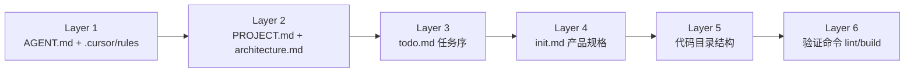

# AuditLens AI — 项目架构文档

> 本文档描述系统架构与 **Cursor Agent Harness** 设计，使 AI 能精准定位模块、遵守边界、按序实施。  
> 操作指令：[AGENT.md](../AGENT.md) · 架构地图：[PROJECT.md](../PROJECT.md) · 任务：[todo.md](../todo.md) · 规格：[init.md](./init.md) · **业务决策：[business-decisions.md](./business-decisions.md)**

---

## 1. 项目概述

AuditLens AI 面向审计/税务场景，通过 **LLM + 规则引擎 + 向量检索** 实现：

- 财务数据自动审计
- 风险识别与评分
- 异常检测与解释
- 自动生成审计报告

---

## 2. 技术栈

| 层级 | 选型 |
|------|------|
| 全栈框架 | Next.js 15 (App Router), TypeScript, TailwindCSS, shadcn/ui |
| AI 编排 | LangGraph（workflow）, LangChain（tools/prompt） |
| LLM | OpenAI / DeepSeek / Claude（可插拔） |
| 向量库 | Pinecone + OpenAI text-embedding-3-small |
| 数据库 | Supabase (Postgres + Auth) |

所有 API、UI、AI orchestration 均在 Next.js 内完成，无独立后端服务。

---

## 3. 系统架构

```text
┌─────────────────────────────────────────────────────────┐
│                    Next.js UI Layer                        │
│  login · dashboard · upload · report/[id]               │
│  components: UploadCard, RiskScoreCard, IssueTable...   │
└──────────────────────────┬──────────────────────────────┘
                           │
┌──────────────────────────▼──────────────────────────────┐
│              API Routes (app/api/)                       │
│  薄层：鉴权 · 校验 · 委托 server                         │
└──────────────────────────┬──────────────────────────────┘
                           │
┌──────────────────────────▼──────────────────────────────┐
│         Audit Orchestrator (server/langgraph.ts)          │
│  ParseExcel → RuleCheck → Anomaly → Score → RAG → Report│
└─────┬──────────────┬─────────────────┬──────────────────┘
      │              │                 │
      ▼              ▼                 ▼
┌──────────┐  ┌─────────────┐  ┌──────────────┐
│ rules.ts │  │ anomaly.ts  │  │   rag.ts     │
│ 确定性   │  │ 统计异常    │  │ Pinecone+LLM │
└──────────┘  └─────────────┘  └──────┬───────┘
                                       │
                    ┌──────────────────┼──────────────────┐
                    ▼                  ▼                  ▼
              lib/ai-provider    lib/pinecone      Supabase DB
```

---

## 4. 目录结构与文件职责

```text
AuditLens/
├── AGENT.md                 # AI 操作指令（命令、边界、导航）
├── PROJECT.md               # 架构地图（入口、模块、风险区）
├── todo.md                  # 分阶段实施清单
├── middleware.ts            # 路由保护
│
├── app/
│   ├── layout.tsx
│   ├── login/page.tsx
│   ├── dashboard/page.tsx
│   ├── upload/page.tsx
│   ├── report/[id]/page.tsx
│   └── api/
│       └── audit/route.ts   # 审计任务创建与触发
│
├── components/
│   ├── UploadCard.tsx
│   ├── RiskScoreCard.tsx
│   ├── IssueTable.tsx
│   └── ReportViewer.tsx
│
├── hooks/
│   └── useAuth.ts
│
├── lib/
│   ├── supabase/
│   │   └── client.ts
│   ├── ai-provider.ts       # LLMProvider + 工厂
│   └── pinecone.ts          # VectorStore + Pinecone
│
├── server/                  # 仅服务端，禁止 client import
│   ├── langgraph.ts         # Graph 定义与节点
│   ├── audit-engine.ts      # 评分与流水线入口
│   ├── rules.ts
│   ├── anomaly.ts
│   └── rag.ts
│
├── types/
│   └── audit.ts             # Record, Issue, Task, GraphState
│
├── docs/
│   ├── init.md              # MVP 产品规格
│   ├── business-decisions.md # 业务规则/阈值 canonical（改规则必更）
│   └── architecture.md      # 本文档
│
└── .cursor/
    └── rules/               # Cursor 分域规则
        ├── core.mdc
        ├── business-decisions.mdc
        ├── nextjs-app.mdc
        ├── server-audit.mdc
        └── ai-layer.mdc
```

---

## 5. 核心模块详解

### 5.1 认证（Supabase Auth）

```text
Login Page → Supabase Auth → JWT Session → middleware.ts → Protected Routes
```

- 客户端：`lib/supabase/client.ts`
- Hook：`hooks/useAuth.ts`
- 保护路径：`/dashboard`, `/upload`, `/report/*`
- 数据隔离：所有业务表查询带 `user_id`

### 5.2 AI Provider（可插拔）

```ts
interface LLMProvider {
  chat(input: string): Promise<string>;
  embed(input: string): Promise<number[]>;
}
```

工厂根据 `process.env.AI_PROVIDER` 选择实现。业务代码**只**依赖接口。

### 5.3 RAG 流程

```text
Risk Event → Embedding → Pinecone Search (topK=5) → Policy Context → LLM Explanation
```

向量库接口：

```ts
interface VectorStore {
  upsert(vectors: VectorRecord[]): Promise<void>;
  search(query: number[]): Promise<SearchResult[]>;
}
```

### 5.4 LangGraph 审计流水线

| 阶段 | 职责 | 输出 |
|------|------|------|
| ParseExcel | 解析 xlsx/csv | `records: Record[]` |
| RuleCheck | invoiceId 重复、审批缺失 | `issues[]` |
| AnomalyDetection | 金额异常、供应商集中 | `anomalies[]` |
| RiskScoring | 加权扣分 | `score: number` |
| RAGExplain | 检索 + LLM | `explanations[]` |
| ReportGeneration | 结构化报告 | `report: string` |

State 在节点间不可变扩展，类型定义在 `types/audit.ts`。

### 5.5 风险规则（MVP）

> **Canonical 细节**：[`business-decisions.md`](./business-decisions.md) §3–§6（阈值、严重程度、评分、RAG 范围）。

摘要：

1. **重复检测**：`invoiceId` 重复 → high  
2. **金额异常**：`amount > avg × 5`  
3. **供应商集中**：单一 vendor 支出占比 > 50%  
4. **审批缺失**：expense 且 `approvedBy` 为空 → medium  
5. **RAG 解释**：仅 `severity === high` 的 issue/anomaly  

评分：`score = 100 - duplicates×10 - anomalies×5 - missingApproval×8`（clamp 0–100）

---

## 6. 数据模型

> **Canonical 文档**：[`supabase/schema.md`](../supabase/schema.md) — 含完整列约束、RLS、索引、ER 图。改库后必须同步该文件。

以下摘要供快速浏览；细节以 `schema.md` 为准。

### audit_tasks

| 字段 | 类型 | 说明 |
|------|------|------|
| id | uuid | PK |
| user_id | uuid | FK → auth.users |
| file_name | text | 上传文件名 |
| status | text | pending / running / completed / failed |
| score | int | 风险评分 |
| created_at | timestamptz | |

### audit_issues

| 字段 | 类型 | 说明 |
|------|------|------|
| id | uuid | PK |
| task_id | uuid | FK |
| type | text | duplicate / anomaly / approval |
| severity | text | low / medium / high |
| reason | text | 规则或 LLM 说明 |
| metadata | jsonb | 关联 record 等 |

### audit_reports

| 字段 | 类型 | 说明 |
|------|------|------|
| id | uuid | PK |
| task_id | uuid | FK |
| content | text | Markdown 报告 |
| created_at | timestamptz | |

### knowledge_base

| 字段 | 类型 | 说明 |
|------|------|------|
| id | uuid | PK |
| content | text | 政策/规则原文 |
| embedding | vector | 可选本地缓存 |
| category | text | 分类标签 |

---

## 7. UI 设计规范

| Token | 值 | 用途 |
|-------|-----|------|
| primary | `#1E3A8A` | 主色、导航 |
| danger | `#EF4444` | 高风险 |
| warning | `#F59E0B` | 中风险 |
| success | `#16A34A` | 正常/通过 |
| bg | `#F8FAFC` | 页面背景 |

风格：Fintech Dashboard，参考 Bloomberg / SAP 企业气质。

页面要点：

- **Upload**：拖拽区 + 分析按钮
- **Dashboard**：KPI 卡片、风险图表、Issue 表
- **Report**：分段文档（Executive Summary / Findings / Recommendations）

---

## 8. Cursor Agent Harness 架构

Harness 目标：让 AI **读什么、改哪里、怎么验** 有明确契约。

### 8.1 六层 Context 模型



| 层级 | 文件 | AI 用途 |
|------|------|---------|
| 操作层 | `AGENT.md` | 命令、边界、模块归属、验证清单 |
| 地图层 | `PROJECT.md` | 入口点、数据流、高风险区 |
| 任务层 | `todo.md` | 实施顺序，防止越级开发 |
| 规格层 | `docs/init.md` | 功能需求与示例代码 |
| Schema 层 | `supabase/schema.md` | 数据库 canonical（改库必更） |
| 规则层 | `.cursor/rules/*.mdc` | 按 glob 自动注入编码约束 |
| 验证层 | package.json scripts | 改动后必须跑的检查 |

### 8.2 文档分工（避免 junk drawer）

| 放什么 | 放哪里 |
|--------|--------|
| 怎么跑、怎么验、安全边界 | `AGENT.md` |
| 架构图、入口、模块依赖 | `PROJECT.md` |
| Phase 任务与进度 | `todo.md` |
| 产品功能、SQL、示例 | `docs/init.md` |
| 完整架构 + harness 说明 | `docs/architecture.md`（本文档） |
| Cursor 专用 scoped 规则 | `.cursor/rules/` |

**不要**把临时任务笔记写入 `AGENT.md`；**不要**在 rules 里复制大段架构原文，用链接引用。

### 8.3 Cursor Rules 矩阵

| 文件 | alwaysApply | globs | 关注点 |
|------|-------------|-------|--------|
| `core.mdc` | true | — | 全局：TS strict、最小 diff、依赖方向 |
| `nextjs-app.mdc` | false | app/**, components/** | React、shadcn、client/server 分界 |
| `server-audit.mdc` | false | server/** | LangGraph 节点、纯函数规则 |
| `database.mdc` | false | supabase/**, types/database.ts | 改库必同步 schema.md |
| `ai-layer.mdc` | false | lib/ai-provider.ts, lib/pinecone.ts, server/rag.ts, server/langgraph.ts | 可插拔接口、无硬编码 key |

### 8.4 AI 修改工作流

```text
1. 读 todo.md → 确认 Phase
2. 读 PROJECT.md → 定位文件
3. 读 AGENT.md → 确认边界与验证
4. 匹配 .cursor/rules → 遵循 glob 规则
5. 实施最小 diff
6. 跑 lint / build
7. 勾选 todo.md
```

### 8.5 可扩展性设计

| 能力 | 扩展方式 |
|------|----------|
| LLM | 新 Provider 实现 `LLMProvider`，注册 `ai-provider.ts` 工厂 |
| 向量库 | 新 Store 实现 `VectorStore`，替换 `pinecone.ts` 或工厂 |
| 数据库 | Supabase → Neon/pgvector：改 client 配置，保持表结构 |
| 规则 | 在 `server/rules.ts` 增函数，LangGraph 节点组装 |

---

## 9. 安全与运维

- 环境变量仅存 `.env.local`，提供 `.env.example` 模板
- Service role key 仅服务端使用，不进 client bundle
- 上传文件：限制 MIME、大小；服务端解析，不落盘到公开目录
- Supabase RLS 强制 `user_id` 匹配 `auth.uid()`

---

## 10. Demo 路径（比赛亮点）

```text
用户登录 → 上传 Excel → 点击分析
  → 3–10s 内 Dashboard 显示 score + issues
  → 打开 Report 查看 AI 生成的审计报告
```

技术亮点：LangGraph workflow · RAG (Pinecone) · 可插拔 AI · Supabase Auth

---

## 附录：相关链接

- [AGENT.md](../AGENT.md)
- [PROJECT.md](../PROJECT.md)
- [todo.md](../todo.md)
- [init.md](./init.md)
