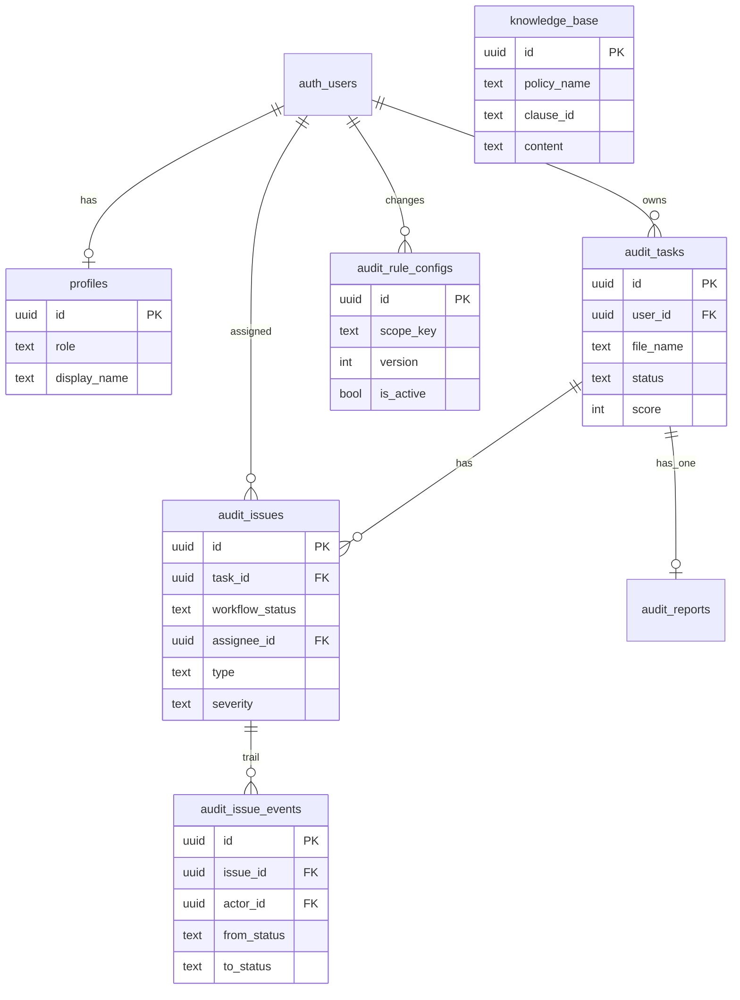

# AuditLens — Database Schema（Canonical）

> **数据库结构的唯一文档源。** 任何 schema 变更后必须同步更新本文件。  
> 来源迁移：  
> - [`migrations/20250619000000_initial_schema.sql`](./migrations/20250619000000_initial_schema.sql)  
> - [`migrations/20260719000000_phase11_enterprise.sql`](./migrations/20260719000000_phase11_enterprise.sql)  
> 最后同步：**2026-07-19** · Phase 11 enterprise

---

## 变更同步清单（必做）

修改数据库（新增 migration、SQL Editor 执行、Dashboard 改表）后，**同一 PR / 同一次提交**内完成：

| # | 文件 | 动作 |
|---|------|------|
| 1 | `supabase/migrations/<timestamp>_<name>.sql` | 新增或更新迁移 SQL |
| 2 | **`supabase/schema.md`（本文件）** | 更新表结构、RLS、索引、关系图 |
| 3 | `types/database.ts` | 同步 `Database` 类型与 row mapper |
| 4 | `types/audit.ts` | 若领域模型变化，同步 AuditTask 等 |
| 5 | `docs/supabase-setup.md` | 若配置步骤变化则更新 |

---

## ER 关系



---

### `public.profiles`

用户角色（审计 / 业务）。注册时由 `handle_new_user` 触发器默认创建 `auditor`。

| 列 | 类型 | 约束 | 说明 |
|----|------|------|------|
| `id` | `uuid` | PK, FK → `auth.users` | 同用户 ID |
| `role` | `text` | NOT NULL, default `auditor`, CHECK | `auditor` \| `business` |
| `display_name` | `text` | nullable | 展示名 |
| `created_at` / `updated_at` | `timestamptz` | NOT NULL | 时间戳 |

---

### `public.audit_tasks`

| 列 | 类型 | 约束 | 说明 |
|----|------|------|------|
| `id` | `uuid` | PK | 任务 ID |
| `user_id` | `uuid` | NOT NULL, FK → `auth.users` | 创建者（审计） |
| `file_name` | `text` | NOT NULL | 上传文件名 |
| `status` | `text` | CHECK | `pending` \| `running` \| `completed` \| `failed` |
| `score` | `integer` | 0–100 或 null | 风险评分 |
| `rule_config_version` | `integer` | nullable | 任务运行时所用规则配置版本 |
| `created_at` / `updated_at` | `timestamptz` | NOT NULL | 时间戳 |

---

### `public.audit_issues`

| 列 | 类型 | 约束 | 说明 |
|----|------|------|------|
| `id` | `uuid` | PK | Issue ID |
| `task_id` | `uuid` | NOT NULL, FK → `audit_tasks` | 所属任务 |
| `type` | `text` | NOT NULL | `duplicate` / `anomaly` / `approval` / `vendor_concentration` |
| `severity` | `text` | CHECK | `low` \| `medium` \| `high` |
| `reason` | `text` | NOT NULL | 规则说明或 LLM 解释 |
| `metadata` | `jsonb` | default `{}` | evidence、ruleId、workpaper 等 |
| `workflow_status` | `text` | default `pending_review` | 工单状态（见下） |
| `assignee_id` | `uuid` | FK → `auth.users`, nullable | 分派给业务用户 |
| `resolution_note` | `text` | nullable | 最近备注 |
| `status_updated_at` | `timestamptz` | nullable | 状态更新时间 |
| `status_updated_by` | `uuid` | FK, nullable | 操作人 |
| `remediation_action` | `text` | nullable | 整改措施说明 |
| `remediation_result` | `text` | nullable | 整改完成说明 |
| `remediation_submitted_at` | `timestamptz` | nullable | 最近提交验收时间 |
| `remediation_submitted_by` | `uuid` | FK, nullable | 提交人 |
| `created_at` | `timestamptz` | NOT NULL | 创建时间 |

**工单状态**：`pending_review` → `confirmed` / `false_positive` → `remediating` → `pending_verification` → `closed`（可重新打开为 `pending_review`；误报可直关）。

**Indexes**：`task_id`, `assignee_id`, `workflow_status`

---

### `public.audit_issue_attachments`

整改证明附件元数据；文件在 Storage bucket `issue-remediation`（private，API 用 service_role 读写）。

| 列 | 类型 | 说明 |
|----|------|------|
| `id` | `uuid` PK | 附件 ID |
| `issue_id` | `uuid` FK → `audit_issues` | 关联问题 |
| `uploaded_by` | `uuid` FK → `auth.users` | 上传人 |
| `kind` | `text` | `evidence` \| `corrected_file` |
| `file_name` / `mime_type` / `byte_size` | | 原始文件信息（≤10MB） |
| `storage_path` | `text` | bucket 内路径 |
| `created_at` | `timestamptz` | 上传时间 |

**Indexes**：`(issue_id, created_at)`

---

### `public.audit_issue_events`

工单状态变更轨迹。

| 列 | 类型 | 说明 |
|----|------|------|
| `id` | `uuid` PK | 事件 ID |
| `issue_id` | `uuid` FK | 关联 issue |
| `actor_id` | `uuid` FK nullable | 操作人 |
| `from_status` / `to_status` | `text` | 状态迁移 |
| `note` | `text` nullable | 备注 |
| `created_at` | `timestamptz` | 时间 |

---

### `public.audit_rule_configs`

版本化规则阈值；每个 `scope_key` 仅一条 `is_active = true`。

| 列 | 类型 | 说明 |
|----|------|------|
| `scope_key` | `text` | 默认 `default`（公司/事业部可选） |
| `amount_anomaly_multiplier` | `float` | 金额异常倍数，默认 5 |
| `vendor_concentration_threshold` | `float` | 供应商占比阈值，默认 0.5 |
| `approval_required_min_amount` | `float` | 必审金额，默认 0（全部支出） |
| `version` | `integer` | 递增版本 |
| `is_active` | `boolean` | 是否当前生效 |
| `changed_by` / `change_note` / `created_at` | | 变更追溯 |

---

### `public.audit_reports`

每个任务唯一一份审计报告（同 Phase 1）。

---

### `public.knowledge_base`

| 列 | 类型 | 说明 |
|----|------|------|
| `content` | `text` | 含制度名+条款号的正文 |
| `policy_name` | `text` nullable | 制度名 |
| `clause_id` | `text` nullable | 条款号 |
| `embedding` | `vector(1536)` | 向量 |
| `category` | `text` nullable | 风险类型标签 |

---

## Functions

| 函数 | 说明 |
|------|------|
| `public.set_updated_at()` | UPDATE 时刷新 `updated_at` |
| `public.handle_new_user()` | 新用户插入默认 `profiles` |
| `public.current_user_role()` | 返回当前用户角色（SECURITY DEFINER） |
| `public.is_task_owner(uuid)` | 当前用户是否为任务 owner（SECURITY DEFINER，供 RLS） |
| `public.has_assigned_issue_on_task(uuid)` | 当前用户是否在该任务上有分派 issue（SECURITY DEFINER） |
| `public.can_access_issue(uuid)` | 当前用户是否可访问该 issue（SECURITY DEFINER） |

---

## Row Level Security

所有业务表均 **ENABLE ROW LEVEL SECURITY**。

### 访问原则（Phase 11）

| 角色 | 可见范围 |
|------|----------|
| **auditor** | 全部 tasks / issues / reports / profiles（`current_user_role() = auditor`） |
| **business**（assignee） | 仅 `assignee_id = auth.uid()` 的 issues；Dashboard 主列表为「我的待办」；可看到含这些 issues 的 tasks / reports |

### 主要 policies

| 表 | Policy 要点 |
|----|-------------|
| `profiles` | 本人 SELECT / INSERT / UPDATE；auditor 可读全部 |
| `audit_tasks` SELECT | auditor **或** owner **或** `has_assigned_issue_on_task(id)` |
| `audit_issues` SELECT/UPDATE | auditor **或** assignee **或** `is_task_owner(task_id)` |
| `audit_reports` SELECT | auditor **或** `is_task_owner` **或** `has_assigned_issue_on_task` |
| `audit_issue_events` | `can_access_issue(issue_id)` |
| `audit_issue_attachments` SELECT | `can_access_issue(issue_id)` |
| `audit_issue_attachments` INSERT/DELETE | assignee + issue `remediating` + 本人上传（API 亦可用 service_role） |
| `audit_rule_configs` | 已登录可读；仅 `current_user_role() = auditor` 可写 |
| `knowledge_base` | 已登录只读 |
| Storage `issue-remediation` | private；推荐仅 service_role 上传/签名下载 |

跨表可见性检查必须通过 **SECURITY DEFINER** 函数（`is_task_owner` / `has_assigned_issue_on_task` / `can_access_issue`），避免 `audit_tasks` ↔ `audit_issues` policy 互相 EXISTS 导致 `42P17` 无限递归。

---

## Grants

```sql
GRANT USAGE ON SCHEMA public TO authenticated;
GRANT SELECT, INSERT, UPDATE ON public.profiles TO authenticated;
GRANT SELECT, INSERT, UPDATE, DELETE ON public.audit_tasks TO authenticated;
GRANT SELECT, INSERT, UPDATE, DELETE ON public.audit_issues TO authenticated;
GRANT SELECT, INSERT, UPDATE, DELETE ON public.audit_reports TO authenticated;
GRANT SELECT, INSERT, UPDATE, DELETE ON public.audit_issue_events TO authenticated;
GRANT SELECT, INSERT, DELETE ON public.audit_issue_attachments TO authenticated;
GRANT SELECT, INSERT, UPDATE ON public.audit_rule_configs TO authenticated;
GRANT SELECT ON public.knowledge_base TO authenticated;
```

---

## TypeScript 映射

| DB 表 | `types/database.ts` | 领域类型 |
|-------|---------------------|----------|
| `profiles` | `Tables.profiles` | `UserRole` / `UserProfile` |
| `audit_tasks` | `mapTaskRow` | `AuditTask` |
| `audit_issues` | `mapIssueRow` | `AuditIssue`（含 workflow / remediation） |
| `audit_issue_attachments` | `mapAttachmentRow` | `IssueAttachment` |
| `audit_issue_events` | `mapIssueEventRow` | `IssueWorkflowEvent` |
| `audit_rule_configs` | `mapRuleConfigRow` | `RuleThresholdConfig` |
| `audit_reports` | `mapReportRow` | `AuditReport` |
| `knowledge_base` | — | `KnowledgeEntry` |

---

## 变更日志

| 日期 | Migration | 说明 |
|------|-----------|------|
| 2026-07-19 | `20260719100000_online_remediation.sql` | `pending_verification`、整改快照列、`audit_issue_attachments`、Storage bucket `issue-remediation` |
| 2026-07-19 | `20260719030000_phase11_fix_rls_recursion.sql` | 用 SECURITY DEFINER 打断 tasks↔issues RLS 递归（业务角色打开 Dashboard 的 42P17） |
| 2026-07-19 | `20260719020000_phase11_rls_auditor_scope.sql` | auditor 全量可读；profiles 审计可读全部；与设计「审计看全量」对齐 |
| 2026-07-19 | `20260719000000_phase11_enterprise.sql` | profiles 角色、issue 工单字段与轨迹、规则配置版本表、KB 制度条款字段、RLS 分派可见性 |
| 2026-06-19 | `20250619000000_initial_schema.sql` | 初始 4 表 + pgvector + RLS + grants |
